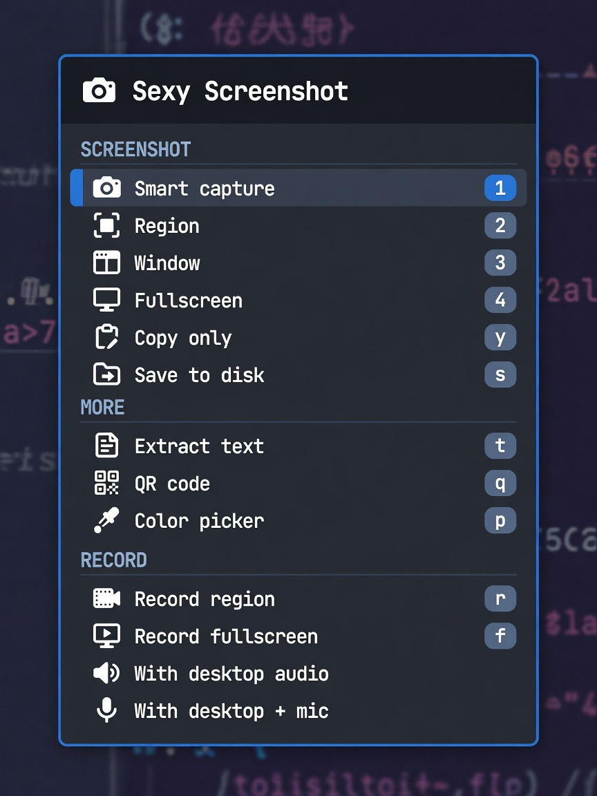

# Sexy Screenshot

A camera icon on the [Omarchy](https://omarchy.org/) bar that runs the same
stock capture commands as Print Screen and the Capture menu.

It does not replace those. It puts them on the bar so you can shoot without
remembering a key.



## Install

```bash
omarchy plugin add https://github.com/unicadesign/omarchy-sexy-screenshot.git --enable
```

Place it on the right of the bar (after the tray):

```bash
omarchy plugin enable unicadesign.sexy-screenshot --section right --after omarchy.tray
```

## Using it

| Input | Action |
| --- | --- |
| Left click | Open / close the panel |
| Right click | Screenshot (smart by default) |
| Middle click | Fullscreen screenshot |
| Click while recording | Panel still opens; Record becomes **Stop recording** |

The icon stays lit while a recording is running.

**Pinned window recording** is separate from classic region/fullscreen
recording. Classic capture is whatever is on the monitor. Pinned uses the
desktop portal: pick a **window**, then switch workspaces — that window stays
in the file. In the share picker, choose a window, not a screen.

**In the panel:** `j` / `k` or arrows move the cursor, `Enter` / `Space` runs
the row. `Esc` closes. Number and letter keys skip the cursor:

| Key | Action |
| --- | --- |
| `1` | Smart capture |
| `2` | Region |
| `3` | Window |
| `4` | Fullscreen |
| `y` | Copy only (clipboard, no file) |
| `s` | Fullscreen, save to disk, skip the editor |
| `t` | Extract text (OCR) |
| `q` | Decode a QR code |
| `p` | Color picker |
| `r` | Start or stop a region recording |
| `f` | Start a fullscreen recording |
| `w` | Pin window recording (window stays captured after you leave the workspace, with desktop audio) |

The panel closes before a capture so it is not in the shot.

## Settings

```bash
omarchy bar set unicadesign.sexy-screenshot closeDelayMs 400
omarchy bar set unicadesign.sexy-screenshot rightClickAction region
```

| Key | Default | Notes |
| --- | --- | --- |
| `closeDelayMs` | `300` | 100–1000. Wait after closing the panel before freeze/grim. |
| `rightClickAction` | `smart` | `smart`, `region`, `windows`, or `fullscreen` |

## IPC

```bash
omarchy-shell unicadesign.sexy-screenshot capture             # smart screenshot
omarchy-shell unicadesign.sexy-screenshot screenshot region
omarchy-shell unicadesign.sexy-screenshot screenshot windows
omarchy-shell unicadesign.sexy-screenshot screenshot fullscreen
omarchy-shell unicadesign.sexy-screenshot record region
omarchy-shell unicadesign.sexy-screenshot record fullscreen
omarchy-shell unicadesign.sexy-screenshot record pinned
omarchy-shell unicadesign.sexy-screenshot stop
omarchy-shell unicadesign.sexy-screenshot status              # idle | classic | pinned
omarchy-shell unicadesign.sexy-screenshot open                # also: close, toggle
```

## What it runs

Stock Omarchy binaries only. No extra packages, no network, no files written
outside the usual Pictures / Videos directories those commands already use.

- `omarchy-capture-screenshot`
- `omarchy-capture-text`
- `omarchy-capture-qr`
- `omarchy-capture-screenrecording` for classic live-screen recording
- `scripts/pinned-window-record` for portal window capture (pinned)
- `hyprpicker -a` for the color picker
- `omarchy-hw-webcam` to show the webcam recording row when a camera exists

## Uninstall

```bash
omarchy plugin remove unicadesign.sexy-screenshot
```

## License

MIT — see [LICENSE](LICENSE).
